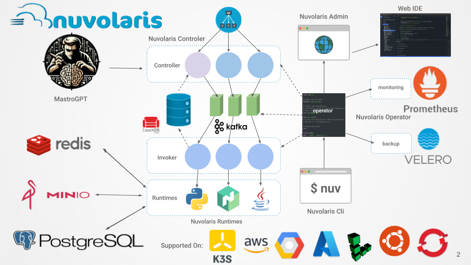
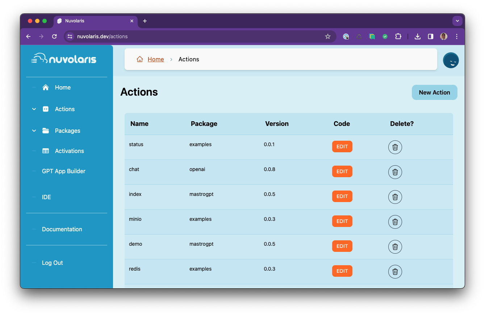
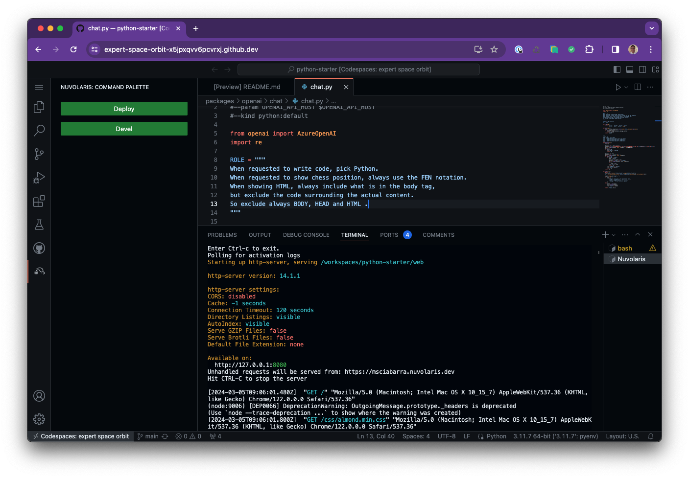
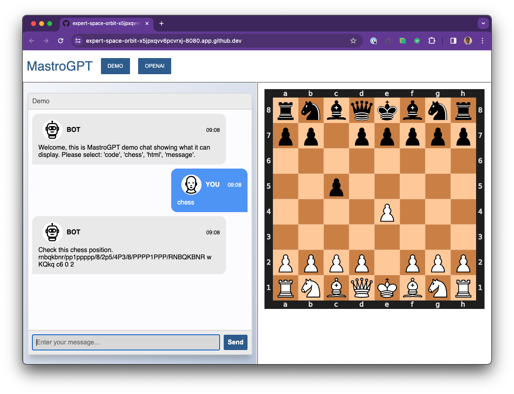

# **Building a  Serverless LLM application**

### using Nuvolaris and MastroGPT

michele@nuvolaris.io

---
# Agenda

- #### Nuvolaris & MastroGPT
- #### Some Pyhton and VSCode tricks
- #### Adding a new chat
- #### Accessing to OpenAI
- #### Interacting with a website


---


---


---


---



---




---


---

# The Python Cli

Using `ipython` with the required libraries

```
nuv -login https://nuvolaris.dev msciabarra
nuv ide python cli
```

Use the env vars for the app:

```python
import os
args = os.environ
```

---
# VScode Keybinding `^+enter`

- Open "keyboad shortcuts"
- search **runSelectedTextInActiveTerminal**
- assign `ˆ+Enter`


---


---

# Create a new chat

- copy "examples/withreqs"

- put `html-sanitizer` in `requirements`

---
# The new chat 

```python
inp = args.get("input", "")
out = "Please provide some input"
if inp != "":
    out = inp[::-1]
res = {
  "output": out
}
return {
    "body": res
}
```

--- 
# Adding to `mastrogpt/index.py`

Adding the new chat to the index

```python
{
    "name": "Search",
    "url": "search/website"
},
```
---

# HTML Output

```
html = f"<h1>{inp}</h1><p>{out}</p>"
res['html'] = html
```

---


---

# class `Chat`

```python
from openai import AzureOpenAI

ROLE = "You are an helpful assistant"
MODEL = "gpt-35-turbo"

class Chat:

    def __init__(self, args):
        key = args.get("OPENAI_API_KEY")
        host = args.get("OPENAI_API_HOST")
        self.ai = AzureOpenAI(api_version="2023-12-01-preview", api_key=key, azure_endpoint=host)

```
---

# `Chat.ask`

```python
def ask(self, inp, role=ROLE):
    system = {"role": "system", "content": role }
    user = {"role": "user", "content": inp}
    request = [system, user]
    comp = self.ai.chat.completions.create(model=MODEL, messages=request)
    content = "ERROR"
    if len(comp.choices) > 0:
        content = comp.choices[0].message.content
    return content
```

