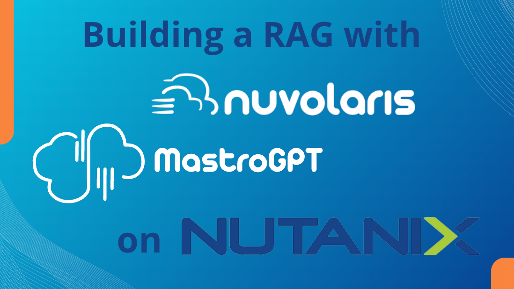
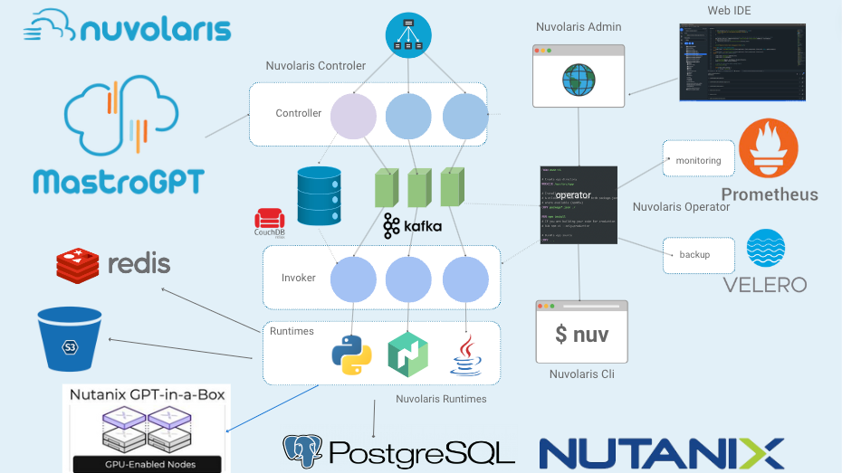

---

# Agenda

1. ### Introducing Nuvolaris & OpenServerless
2. ### Running Nuvolaris on Nutanix
3. ### Building a RAG using Nutanix Services
4. ### Importing Content in the Nutanix Database 

---

---

--- 
## Nuvolaris Components

- ### A scalable serverless engine
- ### S3 File Storage
    - #### public and private
- ### Storage & Cache
  - #### Redis, Postgres, Mongo
- ### Backup & Monitoring

--- 
####  A tour of Nuvolaris

<video src="https://s3.amazonaws.com/v3d.it/nuvolaris/demo-nuvolaris-mastrogpt.mp4#t=0,24 " controls>
</video>

--- 
####  Managing Actions (functions)

<video src="https://s3.amazonaws.com/v3d.it/nuvolaris/demo-nuvolaris-mastrogpt.mp4#t=00:00:24,00:01:20" controls>
</video>
 
--- 
####  IDE Integration

<video src="https://s3.amazonaws.com/v3d.it/nuvolaris/demo-nuvolaris-mastrogpt.mp4#t=00:01:20,00:02:37" controls>
</video>

--- 
####  Sample AI Application

<video src="https://s3.amazonaws.com/v3d.it/nuvolaris/demo-nuvolaris-mastrogpt.mp4#t=00:02:58,00:03:33 " controls>
</video>

--- 
####  Full Stack Hot Reload  

<video src="https://s3.amazonaws.com/v3d.it/nuvolaris/demo-nuvolaris-mastrogpt.mp4#t=00:03:46.500,00:04:37 " controls>
</video>

---

--- 
## Tight Nutanix Integration

  - #### Deployed with Calm scripts
  - #### Running in Nutanix Kubernetes
  - #### Storing Data in Nutanix Databases
  - #### Using LLM with the GPT-in-a-box 

---

---
####  The RAGster

<video src="https://s3.amazonaws.com/v3d.it/nuvolaris/demo-nuvolaris-mastrogpt.mp4#t=00:06:18,06:45:20" controls>
</video>

---
####  Importing Content

<video src="https://s3.amazonaws.com/v3d.it/nuvolaris/demo-nuvolaris-mastrogpt.mp4#t=00:07:14,00:07:36" controls>
</video>

---
####  An example of a GPT App

<video src="https://s3.amazonaws.com/v3d.it/nuvolaris/demo-nuvolaris-mastrogpt.mp4#t=00:07:39,00:08:24" controls>
</video>

---
#### Creating a GPT App

<video src="https://s3.amazonaws.com/v3d.it/nuvolaris/demo-nuvolaris-mastrogpt.mp4#t=00:08:26,00:08:55" controls>
</video>

---
#### Building a GPT App in Nuvolaris

<video src="https://s3.amazonaws.com/v3d.it/nuvolaris/demo-nuvolaris-mastrogpt.mp4#t=00:08:57,00:09:43" controls>
</video>

