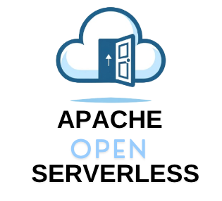
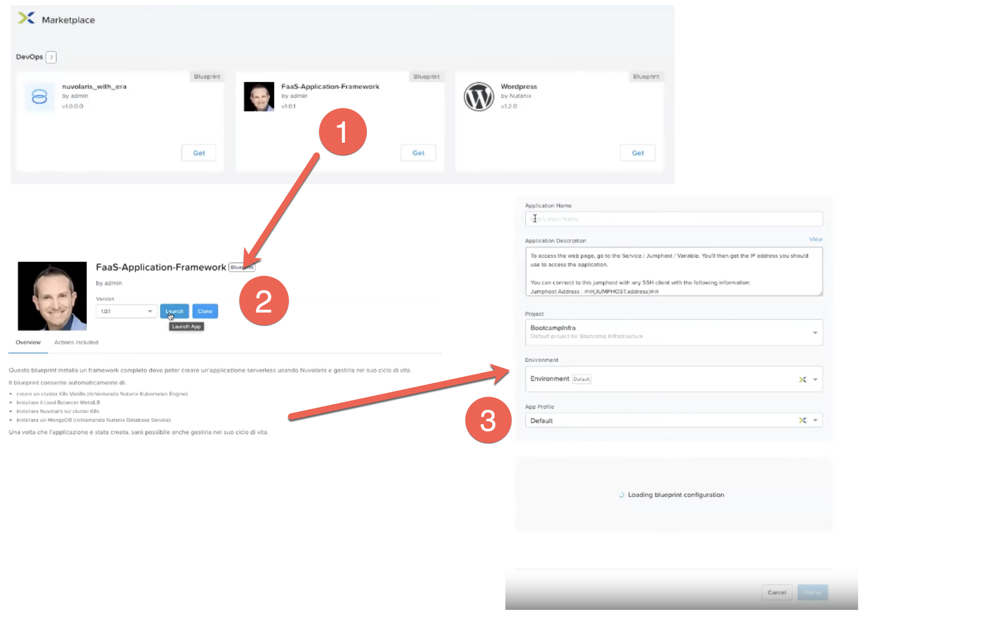

---

# Agenda

1. ### Nuvolaris & OpenServerless on Nutanix
2. ### Building a ChatGPT GPT app on Nuvolaris
3. ### Nuvolaris IDE Integration
4. ### Building a RAG using Nutanix Services
5. ### Installing Nuvolaris on Nutanix

---

--- 
## What is Nuvolaris Private Serverless

- ### A scalable serverless engine
- ### S3 File Storage
    - #### public and private bucket
- ### Storage & Cache
  - #### Using Nutanix Services
- ### LLM integration
  - ### Using GPT-in-a-Box
- ### Backup & Monitoring

---

---
### Apache OpenServerless

- OpenSource project 
  - Accepted for Incubation
- Based on Nuvolaris Community
  - Already available

- Runs Nuvolaris apps

---
# Introducing Nuvolaris

- ## A tour of Nuvolaris
 
   - Building blocks: Actions

- ## Managing Actions
  
   - Edit Actions
   - Invoke actions
   - Inspect logs 

--- 
####  A tour of Nuvolaris

<video src="https://s3.amazonaws.com/v3d.it/nuvolaris/demo-nuvolaris-mastrogpt.mp4#t=0,24 " controls>
</video>

--- 
####  Managing Actions (functions)

<video src="https://s3.amazonaws.com/v3d.it/nuvolaris/demo-nuvolaris-mastrogpt.mp4#t=00:00:24,00:01:20" controls>
</video>
 
---

---

### An Example GPT app

- What is a GPT app?

### A backend function for GPT app

- Serverless is a good fit for GPT  apps

### Bulding a GPT app in Nuvolaris

- Using the integrated builder

---
####  An example of a GPT App

<video src="https://s3.amazonaws.com/v3d.it/nuvolaris/demo-nuvolaris-mastrogpt.mp4#t=00:07:39,00:08:24" controls>
</video>

---
#### A backend function for GPT App

<video src="https://s3.amazonaws.com/v3d.it/nuvolaris/demo-nuvolaris-mastrogpt.mp4#t=00:08:26,00:08:55" controls>
</video>

---
#### Building a GPT App in Nuvolaris

<video src="https://s3.amazonaws.com/v3d.it/nuvolaris/demo-nuvolaris-mastrogpt.mp4#t=00:08:57,00:09:41" controls>
</video>

---

---

## IDE Integration and Starters
- Nuvolaris includes IDE  integration and starters

### Full Stack Hot Reload
- Hot reload of back-end and front-end included

### Instant Deploy
- You application is production ready as deployed

---
####  IDE Integration

<video src="https://s3.amazonaws.com/v3d.it/nuvolaris/demo-nuvolaris-mastrogpt.mp4#t=00:01:20,00:02:37" controls>
</video>

--- 
####  Starter: a Simple AI Application

<video src="https://s3.amazonaws.com/v3d.it/nuvolaris/demo-nuvolaris-mastrogpt.mp4#t=00:02:58,00:03:33 " controls>
</video>

--- 
####  Full Stack Hot Reload  

<video src="https://s3.amazonaws.com/v3d.it/nuvolaris/demo-nuvolaris-mastrogpt.mp4#t=00:03:46.500,00:04:37 " controls>
</video>

--- 
####  Instant Deploy

<video src="https://s3.amazonaws.com/v3d.it/nuvolaris/demo-nuvolaris-mastrogpt.mp4#t=00:04:37.500,00:05:54" controls>
</video>

---

---

# Ragster: a RAG included in Nuvolaris

- an overview of the RAGster

# Importing Content

- we can import content ourself in the database

---
#### Introducing the RAGster

<video src="https://s3.amazonaws.com/v3d.it/nuvolaris/nutanix-presentation.mp4#t=00:06:09,00:06:58" controls>
</video>

---
### Importing Content 

<video src="https://s3.amazonaws.com/v3d.it/nuvolaris/nutanix-presentation.mp4#t=00:07:00,00:08:00" controls>
</video>

---
### Checking the result

<video src="https://s3.amazonaws.com/v3d.it/nuvolaris/nutanix-presentation.mp4#t=00:08:00,00:08:30" controls>
</video>

---

--- 
## Nutanix Integration

  - #### Deployed with Calm scripts
  - #### Running in Nutanix Kubernetes
  - #### Storing Data in Nutanix Databases
  - #### Using LLM with the GPT-in-a-box 

--- 
#### Provisioning from Marketplace

--- 
#####  Provisioning Nuvolaris

<video src="https://s3.amazonaws.com/v3d.it/nuvolaris/nutanix-event.mp4#t=00:55:57,05:00:13" controls>
</video>

