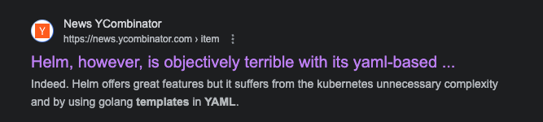
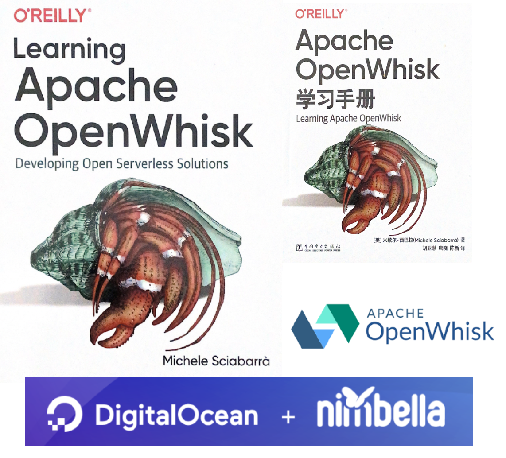

# **TITOLO**
## SOTTOTITOLO

bla bla bla bla

---


---
<!-- backgroundImage: none -->

# <!--fit--> Punti e sottopunti (con [fit title] no background
- **Punto1**:
  spiegazione 



- **Punto2**:
  spiegazione 

  - **Punto3**:
    spiegazione 

---
<!-- backgroundImage: url('https://marp.app/assets/hero-background.jpg') -->


### Immagine a destra

- Ripristinato background


---
# <!--!--> Kubernetes `kubectl` Commands
```txt
# checking nodes and namespaces
kubectl get nodes
kubectl get ns
kubectl create ns demo
kubectl get ns
```

